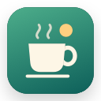
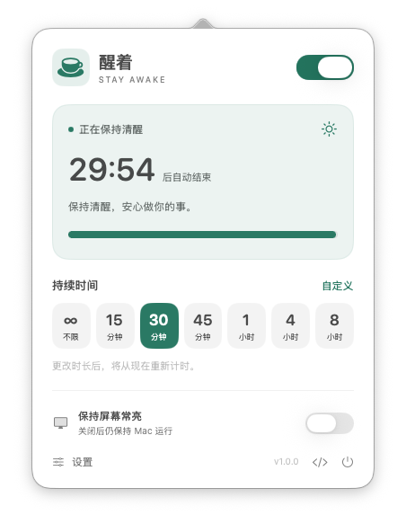
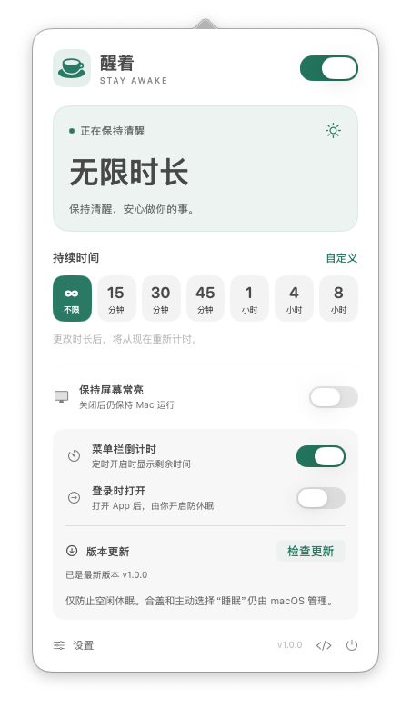

<p align="center">
  
</p>

<h1 align="center">StayAwake · 醒着</h1>

<p align="center">Keep your Mac awake. Let your display rest.</p>

<p align="center">
  <a href="https://github.com/NginxL/StayAwake/releases/latest"></a>
  <a href="https://github.com/NginxL/StayAwake/actions/workflows/build.yml"></a>
  
  <a href="LICENSE"></a>
</p>

<p align="center">
  <strong>English</strong> · <a href="README.zh-CN.md">简体中文</a>
</p>

<p align="center">
  <a href="https://github.com/NginxL/StayAwake/releases/latest"><strong>Download for macOS</strong></a> ·
  <a href="#installation">Installation</a> ·
  <a href="https://github.com/NginxL/StayAwake/issues">Report an issue</a>
</p>

StayAwake is a native macOS menu bar app for preventing idle sleep during downloads, builds, presentations, and other long-running tasks. Choose a duration, turn it on, and control display sleep separately. Built with Swift and SwiftUI, it uses the system's `caffeinate` utility and has no third-party runtime dependencies.

**Compatibility:** macOS 14 or later · Apple Silicon and Intel in one universal app. The app interface is currently **Simplified Chinese**; documentation is available in English and Chinese.

## Screenshots

<table>
  <tr>
    <th align="center">A timer you can see</th>
    <th align="center">Preferences and updates</th>
  </tr>
  <tr>
    <td align="center" valign="top"><a href="docs/images/session.png"></a></td>
    <td align="center" valign="top"><a href="docs/images/settings.png"></a></td>
  </tr>
  <tr>
    <td valign="top">A 30-minute session with remaining time and progress. <strong>保持屏幕常亮</strong> controls whether the display stays on; the Mac can stay awake with it off.</td>
    <td valign="top"><strong>设置</strong> reveals menu bar countdown, launch-at-login preferences, and <strong>检查更新</strong> (Check for Updates). Shown here with an indefinite session.</td>
  </tr>
</table>

<p align="center"><sub>Actual screenshots of StayAwake v1.0.0. Click an image to view it at full size.</sub></p>

## Features

| Feature | What it does |
| --- | --- |
| Quick access | Open the panel from the menu bar or Dock. Right-click the menu bar icon to toggle a session. |
| Flexible duration | Stay awake indefinitely, use 15 / 30 / 45-minute or 1 / 4 / 8-hour presets, or enter 1–1440 minutes. |
| Visible progress | See the countdown and progress in the panel, with an optional countdown in the menu bar. |
| Independent display control | Keep the system awake while allowing the display to sleep, or keep both awake. |
| Optional launch at login | Open the app when you sign in. Sleep prevention stays off until you turn it on. |

## Installation

1. Download `StayAwake-<version>-universal.zip` from the [latest release](https://github.com/NginxL/StayAwake/releases/latest).
2. Unzip it and move `StayAwake.app` into `/Applications` or `~/Applications`.
3. Open the app. Use its coffee cup icon in the menu bar, or click **醒着** in the Dock.

To keep the Dock shortcut, right-click its icon and choose **Options → Keep in Dock**. Keep the application filename `StayAwake.app` for in-app updates.

> **Signing status:** Current releases use ad-hoc signing and are not Apple Developer ID signed or notarized. macOS may block a downloaded copy. You can [build from source](docs/DEVELOPMENT.md#requirements-and-local-build) locally; the build scripts do not change Gatekeeper settings.

## Usage

Select a duration, then turn on the switch in the top-right corner. Choose **∞ / 不限** for an indefinite session; **自定义** opens the custom-duration field. Turn the switch off to end the session early.

| Action | Behavior |
| --- | --- |
| Change the duration while active | Start a new countdown from the current time. |
| Toggle **保持屏幕常亮** (Keep Display Awake) | Change display behavior without resetting the session deadline. |
| Reach the deadline, switch off, or quit | Release StayAwake's sleep-prevention requests. |
| Wake the Mac after the deadline | End the expired session; do not extend it automatically. |

## Updates

Open **设置 → 检查更新** (Settings → Check for Updates). If a newer release is available, choose **下载并安装** (Download and Install). Checks and installation are manual; the app does not silently upgrade itself.

The updater downloads the universal app from this repository's GitHub Releases, verifies its SHA-256 checksum, bundle identifier, version, and code-signature integrity, then replaces and reopens the app. **Updating ends the current session; sleep prevention is off after relaunch.** The app must be in a writable `/Applications` or `~/Applications` folder.

The previous version is kept beside the app as `.StayAwake-previous.app` for manual recovery. The updater does not monitor the new app for crashes. Checksum and ad-hoc signature checks detect integrity problems; they do not authenticate a developer's identity. See [update internals](docs/DEVELOPMENT.md#update-implementation) for details.

## Privacy and sleep behavior

**Does it need a network connection?** Sleep prevention works offline, with no analytics. The app contacts GitHub when you manually check for or download an update; the source-code link opens GitHub in your browser.

**Why can my Mac still lock?** Locking the screen and putting the system to sleep are different. With **Keep Display Awake** off, the display may turn off while the Mac keeps running. StayAwake does not disable the screen saver, automatic locking, or password requirements. Even with the display kept awake, it is not a “prevent lock” utility.

**Will it work with the lid closed?** StayAwake prevents *idle* sleep. It does not guarantee closed-lid operation or override an explicit Sleep command. Those behaviors remain under macOS control.

**Does it change system power settings?** No. It creates temporary `caffeinate` requests instead of modifying `pmset` settings. Turning it off releases only its own requests; another app may still be keeping your Mac awake. Keeping the display on uses more power.

## Development and contributing

Build locally with macOS 14+ and Apple Command Line Tools providing Swift 5.9 or later:

```bash
git clone https://github.com/NginxL/StayAwake.git
cd StayAwake
bash scripts/build.sh
```

The app is created at `dist/StayAwake.app`. See the [development guide](docs/DEVELOPMENT.md) for tests, architecture, universal packaging, and releases.

Bug reports and pull requests are welcome. For a bug report, include the app version, macOS version, Mac architecture, steps to reproduce, and expected versus actual behavior. Remove personal information from logs or screenshots. Keep documentation changes consistent between English and Chinese.

## License

Released under the [MIT License](LICENSE).
